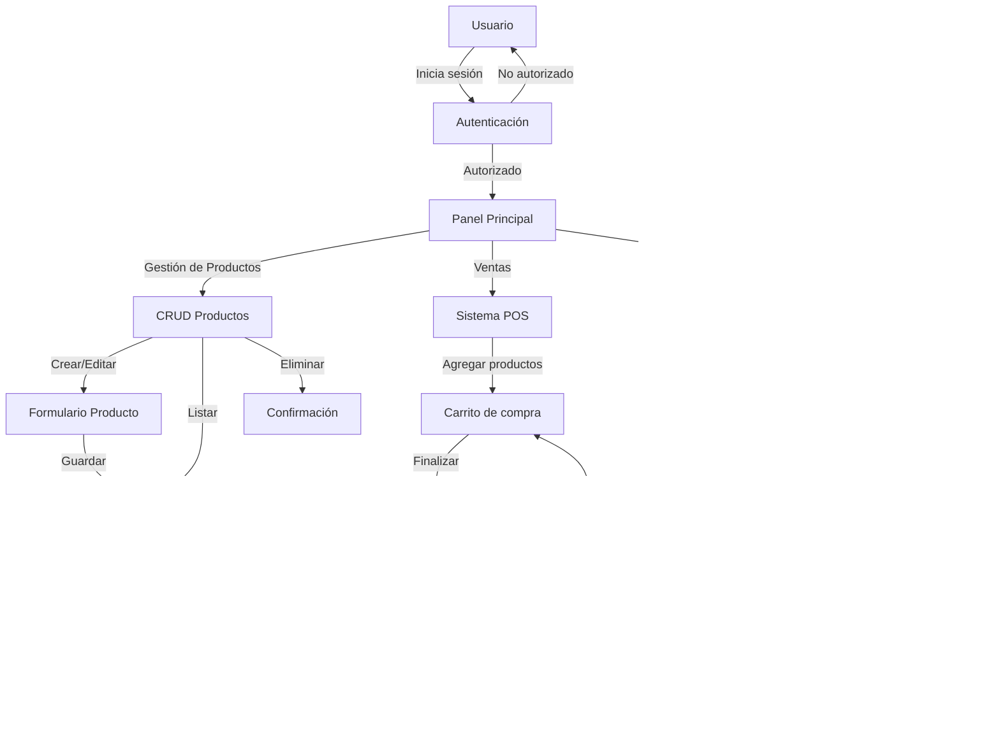
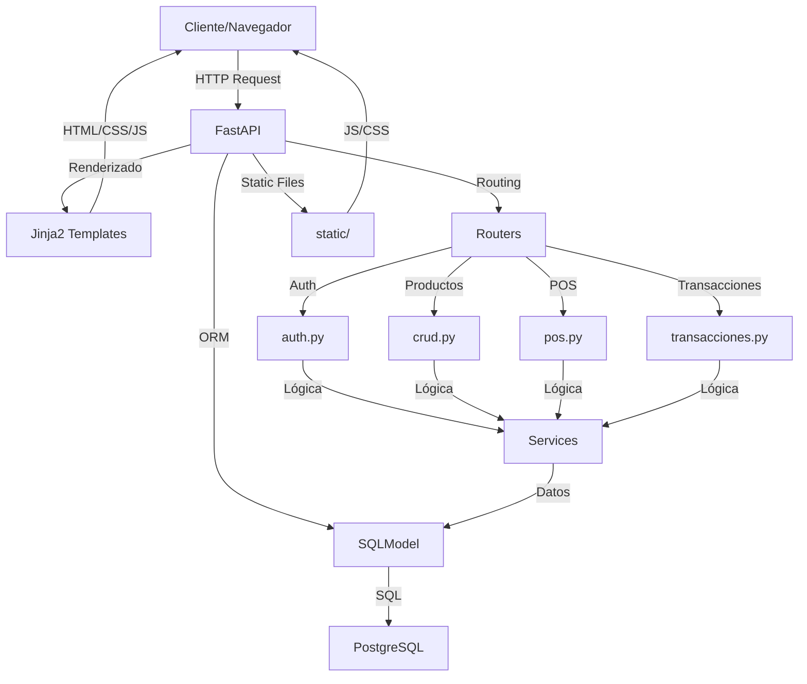
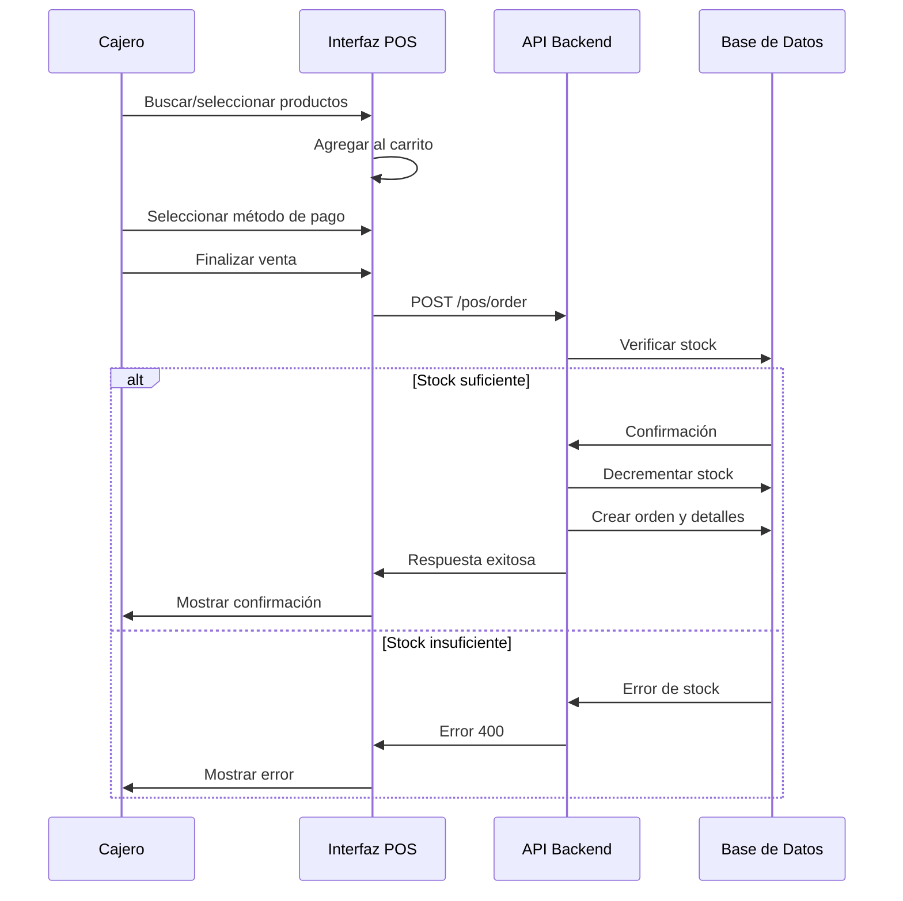
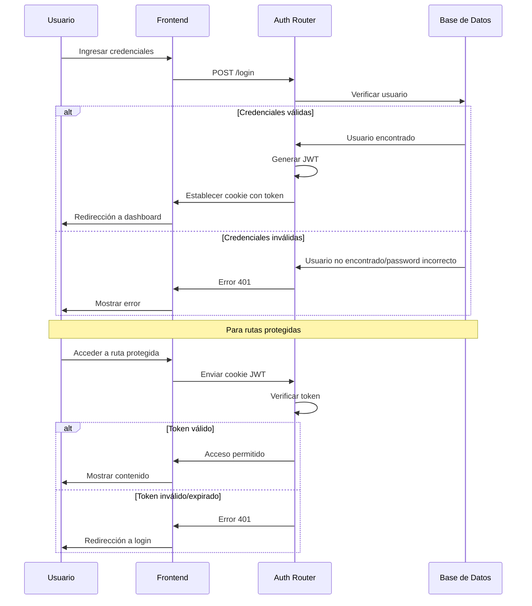
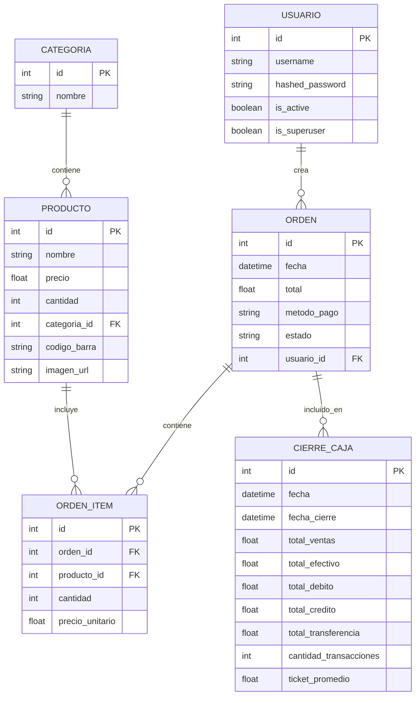

# Diagramas de Flujo del Sistema

## Flujo Principal de la Aplicación

```mermaid
graph TD
    A[Usuario] -->|Inicia sesión| B[Autenticación]
    B -->|Autorizado| C[Panel Principal]
    B -->|No autorizado| A
    
    C -->|Gestión de Productos| D[CRUD Productos]
    C -->|Ventas| E[Sistema POS]
    C -->|Reportes| F[Transacciones/Cierres]
    
    D -->|Crear/Editar| D1[Formulario Producto]
    D -->|Listar| D2[Catálogo Productos]
    D -->|Eliminar| D3[Confirmación]
    D1 -->|Guardar| D2
    
    E -->|Agregar productos| E1[Carrito de compra]
    E1 -->|Finalizar| E2[Selección método pago]
    E2 -->|Confirmar| E3[Procesar orden]
    E3 -->|Éxito| E4[Ticket/Recibo]
    E3 -->|Stock insuficiente| E5[Error]
    E5 --> E1
    
    F -->|Ver historial| F1[Lista transacciones]
    F -->|Cierre de caja| F2[Formulario cierre]
    F1 -->|Seleccionar| F3[Detalle transacción]
    F2 -->|Confirmar| F4[Reporte de cierre]
    F3 -->|Generar| F5[PDF transacción]
```

## Arquitectura del Sistema

```mermaid
graph TD
    A[Cliente/Navegador] -->|HTTP Request| B[FastAPI]
    
    B -->|Renderizado| C[Jinja2 Templates]
    C -->|HTML/CSS/JS| A
    
    B -->|ORM| D[SQLModel]
    D -->|SQL| E[PostgreSQL]
    
    B -->|Routing| F[Routers]
    F -->|Auth| F1[auth.py]
    F -->|Productos| F2[crud.py]
    F -->|POS| F3[pos.py]
    F -->|Transacciones| F4[transacciones.py]
    
    F1 & F2 & F3 & F4 -->|Lógica| G[Services]
    G -->|Datos| D
    
    B -->|Static Files| H[static/]
    H -->|JS/CSS| A
```

## Flujo de una Venta en el POS

```mermaid
sequenceDiagram
    participant C as Cajero
    participant UI as Interfaz POS
    participant API as API Backend
    participant DB as Base de Datos
    
    C->>UI: Buscar/seleccionar productos
    UI->>UI: Agregar al carrito
    C->>UI: Seleccionar método de pago
    C->>UI: Finalizar venta
    UI->>API: POST /pos/order
    API->>DB: Verificar stock
    
    alt Stock suficiente
        DB->>API: Confirmación
        API->>DB: Decrementar stock
        API->>DB: Crear orden y detalles
        API->>UI: Respuesta exitosa
        UI->>C: Mostrar confirmación
    else Stock insuficiente
        DB->>API: Error de stock
        API->>UI: Error 400
        UI->>C: Mostrar error
    end
```

## Flujo de Autenticación

```mermaid
sequenceDiagram
    participant U as Usuario
    participant F as Frontend
    participant A as Auth Router
    participant DB as Base de Datos
    
    U->>F: Ingresar credenciales
    F->>A: POST /login
    A->>DB: Verificar usuario
    
    alt Credenciales válidas
        DB->>A: Usuario encontrado
        A->>A: Generar JWT
        A->>F: Establecer cookie con token
        F->>U: Redirección a dashboard
    else Credenciales inválidas
        DB->>A: Usuario no encontrado/password incorrecto
        A->>F: Error 401
        F->>U: Mostrar error
    end
    
    Note over U,DB: Para rutas protegidas
    U->>F: Acceder a ruta protegida
    F->>A: Enviar cookie JWT
    A->>A: Verificar token
    
    alt Token válido
        A->>F: Acceso permitido
        F->>U: Mostrar contenido
    else Token inválido/expirado
        A->>F: Error 401
        F->>U: Redirección a login
    end
```

## Diagrama Entidad-Relación

```mermaid
erDiagram
    USUARIO ||--o{ ORDEN : crea
    CATEGORIA ||--o{ PRODUCTO : contiene
    PRODUCTO ||--o{ ORDEN_ITEM : incluye
    ORDEN ||--o{ ORDEN_ITEM : contiene
    ORDEN ||--o{ CIERRE_CAJA : incluido_en
    
    USUARIO {
        int id PK
        string username
        string hashed_password
        boolean is_active
        boolean is_superuser
    }
    
    CATEGORIA {
        int id PK
        string nombre
    }
    
    PRODUCTO {
        int id PK
        string nombre
        float precio
        int cantidad
        int categoria_id FK
        string codigo_barra
        string imagen_url
    }
    
    ORDEN {
        int id PK
        datetime fecha
        float total
        string metodo_pago
        string estado
        int usuario_id FK
    }
    
    ORDEN_ITEM {
        int id PK
        int orden_id FK
        int producto_id FK
        int cantidad
        float precio_unitario
    }
    
    CIERRE_CAJA {
        int id PK
        datetime fecha
        datetime fecha_cierre
        float total_ventas
        float total_efectivo
        float total_debito
        float total_credito
        float total_transferencia
        int cantidad_transacciones
        float ticket_promedio
    }
```
